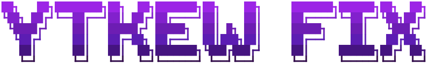

<div align="center">



**YouTube Music on the terminal! fixed by noxygalaxy**

[](https://github.com/dtDhruv/ytkew/actions/workflows/ci.yml)
[](https://github.com/dtDhruv/ytkew/actions/workflows/security.yml)
[](LICENSE)


</div>

ytkew plays music from your YouTube Music account without a browser.

## Requirements

`mpv` 0.30+ and `yt-dlp` on `PATH`, and a truecolor terminal — ytkew refuses
to start without the first two. [Per-platform commands are on the
site](https://dtdhruv.github.io/ytkew/start/install/). Search, radio and
lyrics work signed out; only your own library needs credentials.

**Linux and macOS.** On macOS the spectrum visualizer and media keys are
unavailable since they need PipeWire and D-Bus, but everything else works the
same. Windows is not supported yet.

> [!TIP]
> **An outdated `yt-dlp` is the most common reason a working ytkew stops playing.**
> Keep it current with `yt-dlp -U`.

## Install

```sh
cargo install ytkew
ytkew --install-desktop-entry     # launcher entry and icon
```

Or from source, which does both in one step:

```sh
git clone https://github.com/dtDhruv/ytkew && cd ytkew && make install
```

## Documentation

The documentation is on the site:

### **https://dtdhruv.github.io/ytkew**

## Features

- Full-resolution cover art: kitty graphics, sixel, or truecolor half-blocks.
- Gapless playback. The next track is resolved and buffered while the current
  one plays, so transitions never stall.
- Spectrum visualizer, from a real FFT over the audio output.
- Colours taken from the album art, ten built-in themes, or write your own.
- A library that browses like a file manager, one column per level.
- Search across songs, videos, albums, artists and playlists.
- A queue that behaves like YouTube Music's: a one-off track played
  mid-playlist slots in next instead of throwing the playlist away.
- Optional vim keybindings.
- MPRIS: media keys, and a now-playing panel entry with artwork.
- Mouse support throughout.
- Lyrics, radio, liking tracks, shuffle and repeat.

## Contributing

Bug reports, patches, themes and terminal-compatibility notes are all welcome.
See [CONTRIBUTING.md](CONTRIBUTING.md).

## Licence

[GPL-3.0-or-later](LICENSE).

ytkew is not affiliated with, endorsed by, or connected to YouTube or Google.
It talks to an unofficial API that can change at any time.

## Credits

- [kew](https://github.com/ravachol/kew) for the interface and keybindings 
- [btop](https://github.com/aristocratos/btop) for the banner and the red 
- [ytmapi-rs](https://github.com/nick42d/youtui) for the protocol layer 
- [ratatui](https://github.com/ratatui/ratatui), [mpv](https://mpv.io) and
[yt-dlp](https://github.com/yt-dlp/yt-dlp) for the rest.
